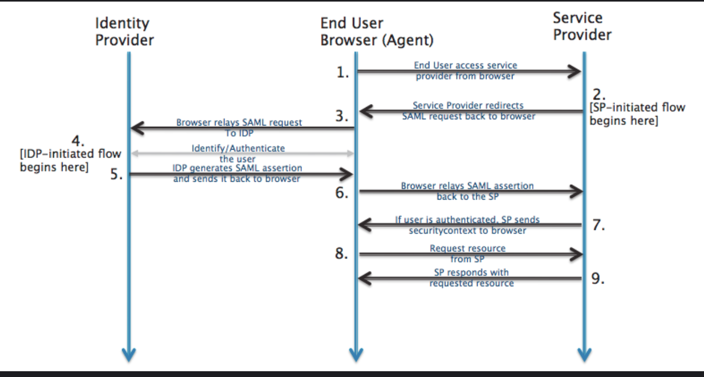
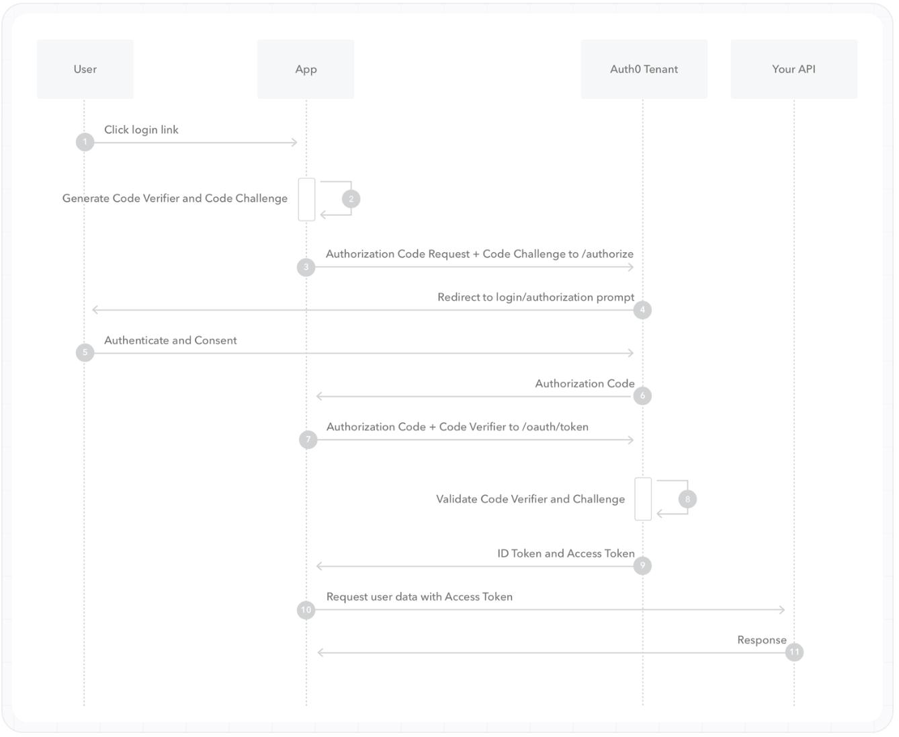

# Authentication
It is the verification of a digital identity. Someone (or something) authenticates to prove that they’re the user they claim to be.  
Generally, transmits info through an ID Token.

## Identity Provider(IdP)
An identity provider(third-party solution) creates, maintains, and manages identity information, and can provide authentication services to other applications. For eg, Google Accounts.  
Identity providers don’t share your authentication credentials with the apps that rely on them.

## Authentication Factors
- Knowledge: Password, Pin
- Possession: Mobile Phone
- Inherence: Fingerprint
**Multi-factor authentication(MFA)**: Uses one or many authentication factors to verify identity.

## Open ID
Identity layer that sits on top of OAuth2.0. 
Reuse an existing account and user profile from an identity provider, for example Apple, Google, or Microsoft to sign-in to any OpenID-enabled applications and websites without creating a new registration and password. Makes it easy to verify user's identity.
Your password is authenticated with your identity provider, and that provider then confirms your identity to the application or website. Applications and websites do not collect, store, or manage your password

## Single-Sign on(SSO) 
centralized location to redirect your users for authentication

### Consumer context: OpenID Connect SSO
### Enterprise context: SAML
Used when the end-user is logged in to a business app and the business app is taking the user to some other third-party app(Service Provider). No need for logging-in again. 
Federated Identity: Service providers do not manage user authentication. Instead, the business share("federate") the user identities with the service provider. And the service provider integrates with existing IdP of the business.

**SAML**: It is an open-standard, XML-based data format that lets businesses communicate user authentication and authorization information to partner companies and enterprise applications that their employees use.
Service Provider and an Identity Provider configure their systems to establish mutual recognition and trust.

Workflow:
- The third-party app(Service Provider) sends the user back to authorization server with a SAML Request that asks authorization server to authenticate the user. 
- Since the user has already authenticated, authorization server verifies that the session is still valid and sends the user back to third-party app with a SAML Response(User identity information). 
- The third-party app checks this response, and if it looks good, the user is granted access.
- 

# Authorization
It is the process of determining what resources a user can access based on identity. Verifies whether access is allowed through policies and rules.  

## Role-based access control(RBAC)
People who have the same role have the same access to resources
## OAuth 2.0
It enables a third-party application to obtain limited access to a resource residing on a resource server(HTTP service) on behalf of the resource owner(user) without ever sharing the user’s credentials.

### Use-cases
Allowing a third party (like Spotify) to access resources on another service (like Google Drive) on behalf of a user without seeing their password.
### Entities involved
- Third-party application or Client
- Resource
- Resource Server
- Resource Owner
- Authorization server: the server that presents the interface where the user approves or denies the request.

### Access token
An OAuth Access Token is a string that the third-party client uses to make requests to the resource server.
Bearer Tokens(JWT) are the default access token type.

### Refresh token
A refresh token is a long-lived credential that clients use to obtain new access tokens when the current one expires — without requiring the user to re-authorize.  
Refresh tokens are issued alongside access tokens in the Authorization Code flow. Use them to silently renew access tokens in the background so users stay logged in across sessions.

### Scope
It limits the third-party application's access to the resource.   
The application can request one or more scopes. This information is presented to the user in consent screen. The access token issued to the third-party application will be limited to the scopes granted.

### Grant Type
- Authorization Code Flow
	- When a first-party(or third-party) app needs access of a resource residing on a resource server, it redirects the user to the authorization server to grant permission.
	- On authenticating at the authorization server and approving the request permissions, the user is redirected back to the first-party(or third-party) app with an authorization code in the URL.
	- The first-party(or third-party) app can exchange the authorization code along with client credentials for the access token from the authorization server's token endpoint.
	- PKCE is always used to prevent authorization code injection attacks
	- Use it when a user needs to grant the app(running on browser or mobile) access to their account/data.
	- Since browser-based apps cannot maintain the secrecy of client secret, **PKCE** works by having the client generate a random client secret called a _code verifier_, then derive a _code challenge_ from it using hash function. 
		- The code challenge is sent with the authorization request, 
		- and the code verifier is sent when exchanging the authorization code for a token. 
		- The authorization server will hash the code verifier and compare it to the challenge sent in the authorization request, and only issue the access token if they match.
		- This ensures only the client that started the flow can complete it.
		- 
- Password
	- For first party apps
- Client credentials
	- Used for machine-to-machine communication. Common examples: a cron job that syncs data, a microservice calling another internal service, or a server-side process accessing a shared resource.
	- the client sends its `client_id` and `client_secret` to the token endpoint with `grant_type=client_credentials`. There is no redirect, no user login, and no refresh token — just a direct exchange of credentials for an access token.
	- Because access tokens are short-lived, clients should request a new one when the current one expires rather than storing it permanently.
- Device Authorization Grant
	- Used for apps that run on TVs etc
	- The device POSTs to the device authorization endpoint and receives a `device_code`, a `user_code`, and a `verification_uri`.
	- The user is displayed with code and URL.
	- The user opens the URL and approves the request on a separate device like their phone.
	- The app polls the token endpoint until the user completes authorization, at that time, the app gets the access token.
- Client-Initiated Backchannel Authentication
	- Used in call center call etc

### Creating client
Registering a new app with the service: When registering a new app, you usually register basic information such as application name, website, a logo, etc. In addition, you must register a redirect URI to be used for redirecting users to.  
After registering your app, you will receive a client ID and optionally a client secret.

### Dynamic Client Registration
It lets the third-party apps register themselves programmatically, submitting their metadata and receiving client_id and client_secret.
Use when clients need to register at runtime — for example, 
- in open ecosystems where any developer can build a client against your API, 
- in federated identity deployments where clients are registered automatically during federation, or 
- in multi-tenant platforms where each tenant gets its own client credentials.

### Token Exchange
Token exchange can be done at the API gateway so downstream services get scoped, audience-restricted tokens rather than the user's raw token.

### mTLS in OAuth 2.0
With mTLS authentication, the client certificate with a private key functions like a Client Secret in an OAuth/OIDC flow to verify the client’s identity.  
Client certificates can be used with multiple servers to prove a client’s identity to a resource server.  
Before the authorization server processes the authorization code request, it must first verify the client’s mTLS certificate.